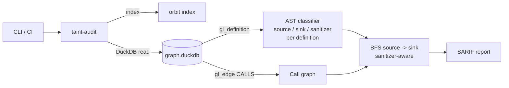

# Taint-Flow Auditor

> Interprocedural reachability auditor for security taint flows, powered by [GitLab Orbit Local](https://gitlab.com/gitlab-org/orbit/knowledge-graph).

Most SAST tools either drown you in noise or miss real bugs that cross file
boundaries. Taint-Flow Auditor walks **Orbit's interprocedural `Definition
CALLS Definition` graph** to find genuine paths from untrusted sources (HTTP
handlers, CLI args) to dangerous sinks (SQL exec, shell, deserialize,
filesystem) — with a suggested fix per finding.

## How it works



Orbit Local indexes the repo and produces, for each function/class/method
across 11+ languages: a `Definition` row with line range, and a `Definition
CALLS Definition` edge for every inter-procedural call. We do **not** synthesize
the call graph — we use Orbit's directly. AST is used only for *predicate
refinement* inside each Definition's body: which decorator was applied, which
sink pattern matched, whether the first argument to `cursor.execute` is a
string literal, and whether a sanitizer is present. BFS from sources to sinks
uses Orbit's call edges, demoting paths that cross a known sanitizer.

**Honest scope (v1):** Python only. Function-level reachability
(over-approximate — we do not track which argument is tainted). Hand-curated
source/sink/sanitizer catalog. False positives are expected and tolerable for a
security tool; missed true positives are not. Method calls on locals (e.g.
`cursor.execute` where `cursor` is a local var) are invisible to Orbit's call
graph, but the function that *contains* them is reachable, which is sufficient
for classifying that function as a sink.

## Quickstart

```bash
# Prereq: install Orbit Local (https://gitlab.com/gitlab-org/orbit/knowledge-graph)
curl -fsSL "https://gitlab.com/gitlab-org/orbit/knowledge-graph/-/raw/main/install.sh" | bash

# Clone and install this tool
git clone https://github.com/faketut/Taint-Flow-Auditor.git
cd Taint-Flow-Auditor
pip install -e .

# Index your repo and run the audit
orbit index .
taint-audit scan . --output findings.sarif
```

To try it on the bundled vulnerable demo:

```bash
cd examples/demo-app
orbit index .
taint-audit scan . --pretty
```

## Output

Real output from `taint-audit scan examples/demo-app` against the bundled demo:

```
HIGH  cmd.py:9   sink=subprocess.run
        source: views.ping     (reads request.args)
        path:   views.ping -> cmd.do_ping
HIGH  db.py:20   sink=cursor.execute
        source: views.search   (reads request.args)
        path:   views.search -> db.run_search -> db.run_query
MEDIUM files.py:6 sink=open
        source: views.export   (reads request.args)
        path:   views.export -> files.read_export
LOW   cmd.py:21  sink=subprocess.run
        source: views.healthy_ping   (reads request.args)
        path:   views.healthy_ping -> cmd.do_safe_ping
        note:   path crosses a known sanitizer (severity demoted)
```

A fifth function in the demo — `cli.dump_table` — also reaches `cursor.execute`
through the call graph, but is correctly **not** flagged because it is not a
source (no HTTP decorator, no `request.*` read).

Findings are emitted as SARIF 2.1.0 (`--output findings.sarif`) and as a
human-readable table (`--pretty`).

## Extending the catalog

Sources, sinks, and sanitizers are extensible via YAML — no Python required:

```
catalog/
  sources.yaml       # decorators and accessors that introduce taint
  sinks.yaml         # function patterns that are dangerous if reached
  sanitizers.yaml    # function patterns that neutralise taint
```

Each entry has a regex pattern, a kind (`call` / `decorator` / `attribute`),
and an optional argument predicate (`not_string_literal`, etc.). See the
shipped YAML for examples.

## CI

This repo runs its own tests under [GitHub Actions](.github/workflows/test.yml).
The auditor itself emits SARIF, which any modern CI (GitHub Code Scanning,
GitLab SAST, Sonar, etc.) can ingest. A minimal GitHub Actions job:

```yaml
- run: pip install -e .
- run: |
    curl -fsSL "https://gitlab.com/gitlab-org/orbit/knowledge-graph/-/raw/main/install.sh" | bash
    orbit index .
    taint-audit scan . --output findings.sarif
- uses: github/codeql-action/upload-sarif@v3
  with:
    sarif_file: findings.sarif
```

## Limitations and next steps

- Function-level reachability only — no per-argument taint tracking.
- Python only in v1; the resolver design supports adding JS/TS, Go later.
- Sanitizer awareness is allow-list based (downgrade severity if path crosses a
  sanitizer). Real sanitiser semantics are future work.
- Sources, sinks, and sanitizers are extensible via `catalog/*.yaml`.

## License

MIT. See [LICENSE](LICENSE).
